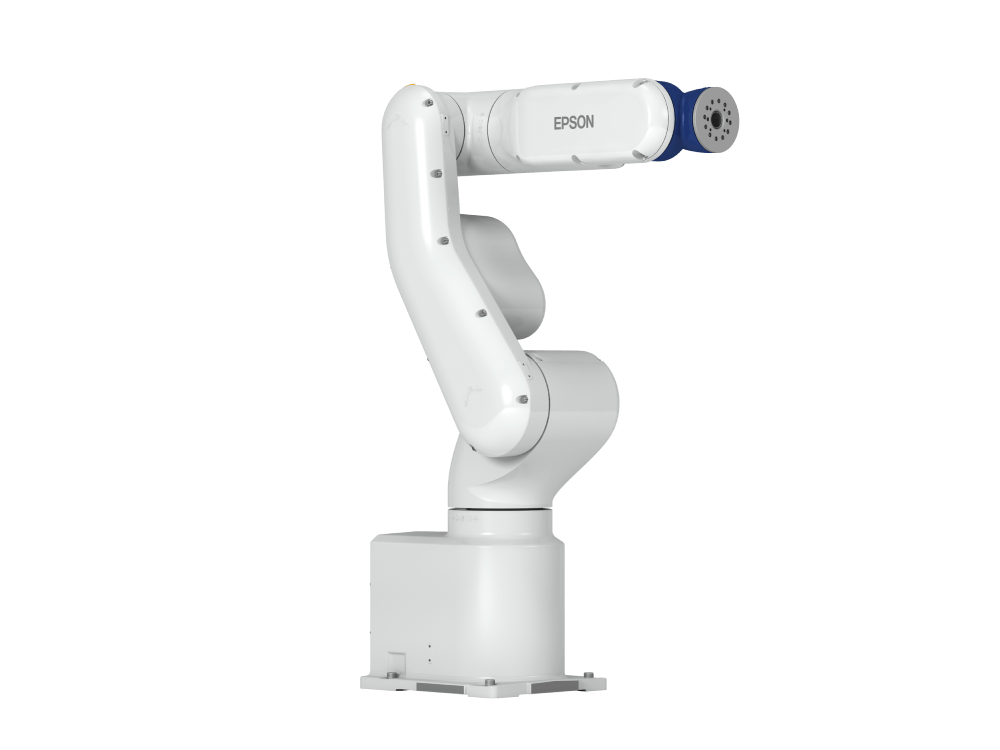

# Laboratorio 2 EpsonCDM

<a name="readme-top"></a>

<!-- PROJECT LOGO -->
<br />
<div align="center">
  <a href="https://github.com/Danmunozbe/Practica1/tree/Pain2">
    
  </a>

  <h3 align="center">Laboratorio 2: Manejo y programación de robot de 6 ejes (Epson)</h3>

  <p align="center">Robótica
    <br />
    <a href="https://github.com/Danmunozbe/Practica1/tree/Pain2"></a>
    <br />Daniel Muñoz · Christian Vargas
  </p>
</div>


<!-- TABLE OF CONTENTS -->
<details>
  <summary>Índice</summary>
  <ol>
    <li>
      <a href="#introducci%C3%B3n">Introducción</a>
    </li>
    <li>
      <a href="#Desarrollo">Desarrollo</a>
      <ul>
        <li><a href="#conf">Configuración del proyecto</a></li>
        <li><a href="#spel">Código en SPEL+</a></li>
      </ul>
    </li>
    <li><a href="#Resultados">Resultados</a></li>
  </ol>
</details>


<!-- Intro -->
## Introducción
Como parte del contenido de la asignatura, se procura dar a los ingenieros en formación una aproximación general a los diferentes tipos de robots en aplicaciones industriales. En ese sentido, uno de los trabajos propuestos es la programación de una rutina de paletizado en un robot de seis ejes, de la marca Epson.

El robot VT6-A901S, utilizado en esta ocasión, ofrece una serie de ventajas importantes para su gamma de entrada. Algunas de sus especificaciones técnicas son:

- Alcance del brazo: 920 mm
- Carga máxima soportada: 6 kg
- Repetibilidad: ± 0.1 mm

En la figura a continuación se puede apreciar el robot en cuestión.

<div align="center">

</div>
De manera complementaria, en este repositorio se encuentra el material elaborado en la práctica de laboratorio 2, en las instalaciones de CDM.

<!-- GETTING STARTED -->
## Desarrollo


### Configuración del proyecto

En primera instancia, se crearon el proyecto y el controlador a utilizar en el mismo. Luego se seleccionó el robot con el que se iba a desarrollar la práctica (en este caso correspondiente al VT6-A901S), y se realizaron las configuraciones de puntos en los que se haría el paletizado, así como la posición de HOME.


(Puntos fijados)

(Posición de HOME)


### Código en SPEL+
Algunos de los comandos/instrucciones principales en el código fueron:

`Go`: Mueve el robot a un punto con un movimiento de punto a punto  
`Move`: Mueve el robot con interpolación lineal  
`Speed`: Define/arroja la velocidad para los comandos de movimiento de 
punto a punto.  
`Accel`: Define/arroja la aceleración y desaceleración para el movimiento de 
punto a punto.  
`Pallet`: Define un pálet o arroja un punto de pálet

El código utilizado puede ser consultado en la sección ```Proyecto/Lab2/Main.prg```

## Resultados

### Robot en funcionamiento - EPSON RC

[](https://youtu.be/1gSif0rYGPc)  

### Robot en funcionamiento - Entorno de laboratorio


[](https://youtu.be/AFP7Mb8rkzY)  


##  Conclusiones

1. Uno de los principales aspectos a destacar es la facilidad y practicidad para programar el robot de EPSON en comparación al de ABB disponible en el laboratorio de la universidad. El controlador del VT6-A901S está integrado en el robot, de manera que para cargar la rutina de trabajo en él, solo es necesario hacer una conexión directa por USB y correr el programa. Esto ofrece un ahorro considerable de tiempo en el proceso de pruebas y ejecución.
2. El lenguaje de programación SPEL+, así como RAPID para ABB, ofrecen una herramienta intuitiva y directa para programar los robots respectivos. Resulta importante identificar esta similitud entre fabricantes, pues facilita las tareas como ingenieros. 


